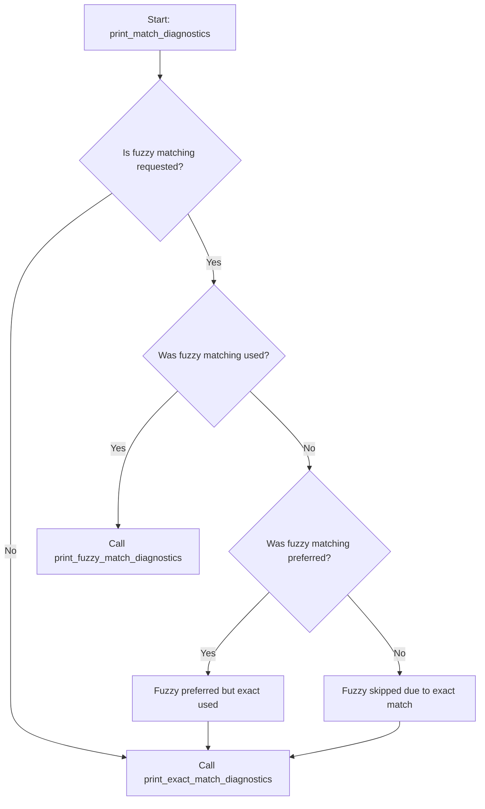

# Debug Diagnostics

CharFinder includes a powerful `--debug` flag that provides detailed insight into how your query was processed. This document explains the structure, components, and behavior of debug diagnostics and how they relate to the CLI arguments, matching strategies, and `.env` configuration.

---

## Overview

Enabling `--debug` outputs structured debug diagnostics, including:

1. **Parsed CLI arguments**
2. **Match strategy used**
3. **Exact vs fuzzy diagnostics**
4. **.env and environment configuration details**

These diagnostics are especially useful for understanding why certain results appeared or why fuzzy matching was skipped.

---

## Enabling Debug Diagnostics

Use the `--debug` flag in combination with your query:

```bash
charfinder hear --debug --fuzzy
```

This will print the matching results (if any), followed by a debug diagnostics block.

You can also control verbosity using `--verbose` to show results and logs simultaneously.

---

## Diagnostic Structure

The debug output is composed of three major sections:

### 1. Parsed CLI Arguments

This section lists all parsed CLI arguments as key-value pairs:

```
[DEBUG] Parsed args:
[DEBUG]   color                = auto
[DEBUG]   debug                = True
[DEBUG]   exact_match_mode     = word-subset
[DEBUG]   fuzzy                = True
[DEBUG]   fuzzy_algo           = token_sort_ratio
[DEBUG]   fuzzy_match_mode     = hybrid
[DEBUG]   hybrid_agg_fn        = mean
[DEBUG]   threshold            = 0.7
```

These values determine how the match strategy is selected and executed.

### 2. Match Strategy Diagnostics

This section is generated by `print_match_diagnostics()` and dispatched into one of two specialized diagnostics:

#### a. Exact Match Diagnostics

Output when fuzzy was not used:

```
[DEBUG] Fuzzy matching was not requested.
[DEBUG] === MATCH STRATEGY ===
[DEBUG] Exact match strategy executed.
[DEBUG] Exact match mode: 'word-subset'
[DEBUG] === END MATCH STRATEGY ===
```

Also triggered if exact match succeeded and fuzzy was skipped:

```
[DEBUG] Fuzzy requested but skipped due to exact match success.
```

#### b. Fuzzy Match Diagnostics

If fuzzy matching was used:

```
[DEBUG] === MATCH STRATEGY ===
[DEBUG] Fuzzy match strategy executed.
[DEBUG] Fuzzy match mode: 'single'
[DEBUG] Fuzzy algorithm: 'token_sort_ratio'
[DEBUG] === END MATCH STRATEGY ===
```

For hybrid mode:

```
[DEBUG] === MATCH STRATEGY ===
[DEBUG] Fuzzy match strategy executed.
[DEBUG] Fuzzy match mode: 'hybrid'
[DEBUG] Aggregation function: 'mean'
[DEBUG] Fuzzy algorithms used:
[DEBUG]   simple_ratio           (weight=0.15)
[DEBUG]   normalized_ratio       (weight=0.15)
[DEBUG]   levenshtein_ratio      (weight=0.15)
[DEBUG]   token_sort_ratio       (weight=0.55)
[DEBUG] === END MATCH STRATEGY ===
```

### 3. .env Debug Diagnostics

This is handled by `print_dotenv_debug()` if `MYPROJECT_DEBUG_ENV_LOAD=1` or explicitly enabled:

```
[DEBUG] === DOTENV DEBUG ===
[DEBUG] Selected .env file: .../.env
[DEBUG]   CHARFINDER_ENV = DEV
[DEBUG]   CHARFINDER_LOG_MAX_BYTES = 1000000
[DEBUG]   CHARFINDER_COLOR_MODE = auto
[DEBUG] === END DOTENV DEBUG ===
```

---

## Logic Diagram: Match Diagnostics Flow



---

## Development Notes

* The dispatcher `print_match_diagnostics()` decides what to show.
* The helper `_debug_echo()` sends formatted messages to both terminal and log.
* Colorized output is controlled by `use_color`, passed from CLI args.

---

## Related CLI Flags

| Flag                 | Description                                     |
| -------------------- | ----------------------------------------------- |
| `--debug`            | Enables detailed internal diagnostics           |
| `--verbose`          | Shows normal console output in addition to logs |
| `--fuzzy`            | Enables fuzzy matching                          |
| `--fuzzy-match-mode` | Choose between `single` or `hybrid` modes       |
| `--fuzzy-algo`       | Select algorithm (e.g., `token_sort_ratio`)     |

---

## Examples

### Example 1: Fuzzy match skipped due to exact match

```
charfinder ear --debug --fuzzy
```

Output excerpt:

```
[DEBUG] Fuzzy requested but skipped due to exact match success.
[DEBUG] Exact match mode: 'word-subset'
```

### Example 2: Fuzzy single-mode match

```
charfinder hear --debug --fuzzy
```

Output excerpt:

```
[DEBUG] Fuzzy match mode: 'single'
[DEBUG] Fuzzy algorithm: 'token_sort_ratio'
```

### Example 3: Hybrid fuzzy match

```
charfinder hear --debug --fuzzy --fuzzy-match-mode hybrid
```

Output excerpt:

```
[DEBUG] Fuzzy match mode: 'hybrid'
[DEBUG] Aggregation function: 'mean'
[DEBUG] Fuzzy algorithms used:
  simple_ratio (weight=0.15)
  token_sort_ratio (weight=0.55)
```

---

## Conclusion

CharFinder's debug diagnostics provide a transparent view into internal behavior, enabling both developers and users to understand how inputs and configurations influence matching results.

These diagnostics are designed for precision, testability, and future extensibility.
