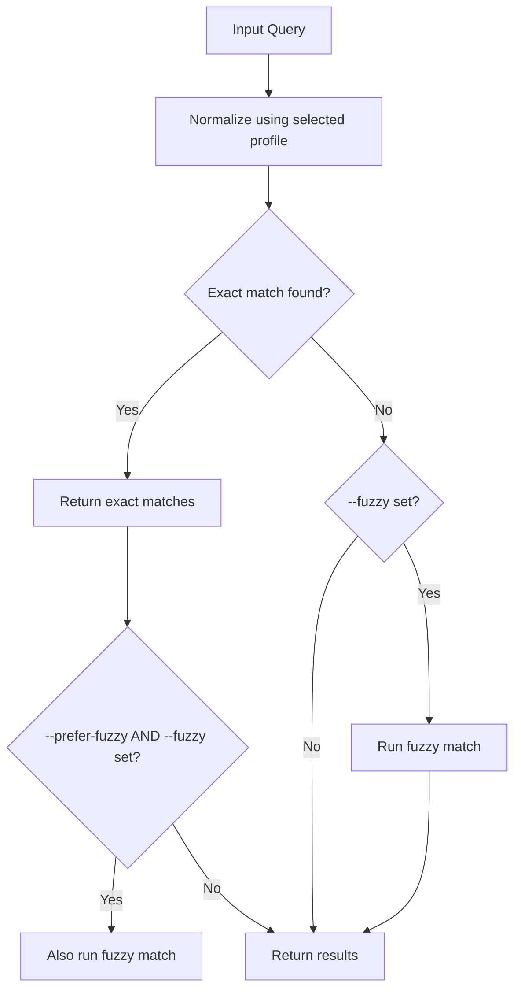

# Matching Logic in CharFinder

This document provides a deep technical reference for the core matching behavior in **CharFinder**. It explains exact and fuzzy matching logic, CLI argument influence, default behavior, scoring algorithms, hybrid logic, diagnostics, and result representations.

---

## 1. Overview

CharFinder searches Unicode character names using **exact** and/or **fuzzy** matching. The process is governed by a `SearchConfig` structure and influenced by CLI arguments or API parameters. Normalization is always applied using a selected normalization profile (`--normalization-profile`), ensuring robust and consistent comparisons across character names.

---

## 2. Matching Flow



---

## 3. CLI Arguments Affecting Matching

| Argument                                     | Description                                                                     |
| -------------------------------------------- | ------------------------------------------------------------------------------- |
| `--fuzzy`                                    | Enables fallback to fuzzy matching if exact match fails.                        |
| `--prefer-fuzzy`                             | Also returns fuzzy matches even if exact matches were found.                    |
| `--threshold FLOAT`                          | Minimum fuzzy score \[0.0, 1.0] to accept a match (default: `0.65`).            |
| `--exact-match-mode {substring,word-subset}` | Exact match strategy. Default: `word-subset`.                                   |
| `--fuzzy-match-mode {single,hybrid}`      | Fuzzy match strategy. Default: `hybrid`.                                         |
| `--fuzzy-algo ALGO`                          | Selects fuzzy algorithm. Default: `token_subset_ratio`. Ignored in hybrid mode. |
| `--hybrid-agg-fn {mean,median,max,min}`      | Aggregation function in hybrid mode. Default: `mean`.                           |

---

## 4. Exact Matching

### Modes

| Mode          | CLI Option                                 | Description                                                      |
| ------------- | ------------------------------------------ | ---------------------------------------------------------------- |
| `substring`   | `--exact-match-mode substring`             | Query must be a literal substring of the name.                   |
| `word-subset` | `--exact-match-mode word-subset` (default) | All query words must appear in the name (order does not matter). |

---

## 5. Fuzzy Matching

### Match Modes

| Mode     | CLI Option                           | Description                                                               |
| -------- | ------------------------------------ | ------------------------------------------------------------------------- |
| `single`    | `--fuzzy-match-mode single`             | Runs fuzzy match mode using a single algorithm                        |
| `hybrid` | `--fuzzy-match-mode hybrid`          | Score using multiple algorithms, aggregate results, then apply threshold. |

### Available Algorithms (`--fuzzy-algo`)

| Algorithm            | Description                                                          | Used in Hybrid? |
| -------------------- | -------------------------------------------------------------------- | --------------- |
| `simple_ratio`       | SequenceMatcher-based ratio (fast character overlap).                | ✅               |
| `normalized_ratio`   | Normalized ratio accounting for case and space differences.          | ✅               |
| `levenshtein_ratio`  | Edit-distance based similarity (more expensive).                     | ✅               |
| `token_sort_ratio`   | Token-based sort before comparison (handles word reordering well).   | ✅               |
| `token_subset_ratio` | Token subset matching; penalizes extra or missing words. *(default)* | ❌               |
| `hybrid_score`       | Internal alias; not directly available via CLI.                      | N/A             |

> Note: If `--fuzzy-match-mode=hybrid` is selected, the `--fuzzy-algo` value is ignored.

### Hybrid Mode Details

If `--fuzzy-match-mode hybrid` is selected:

* These four algorithms are used in combination:

  * `token_sort_ratio`
  * `simple_ratio`
  * `normalized_ratio`
  * `levenshtein_ratio`

* **Weights** applied to each algorithm:

| Algorithm           | Weight |
| ------------------- | ------ |
| `simple_ratio`      | 0.00   |
| `normalized_ratio`  | 0.00   |
| `levenshtein_ratio` | 0.30   |
| `token_sort_ratio`  | 0.10   |
| `token_subset_ratio` | 0.60  |

---

## 6. SearchConfig Object

```python
@dataclass
class SearchConfig:
    fuzzy: bool
    threshold: float
    name_cache: dict[str, dict[str, str]] | None
    verbose: bool
    debug: bool
    use_color: bool
    fuzzy_algo: FuzzyAlgorithm
    fuzzy_match_mode: FuzzyMatchMode
    exact_match_mode: str
    agg_fn: HybridAggFunc
    prefer_fuzzy: bool
    normalization_profile: NormalizationProfile
    hybrid_weights: HybridWeights  # Not exposed via CLI
```

---

## 7. Result Representation

### Internal Tuple: `MatchTuple`

```python
(code: int, char: str, name: str, score: float | None)
```

### Public Dict: `CharMatch`

```python
TypedDict('CharMatch', {
    'code': str,
    'char': str,
    'name': str,
    'score': NotRequired[float]
})
```

Converted using:

```python
from utils.formatter import matchtuple_to_charmatch
```

### Diagnostic Result Wrapper

```python
@dataclass
class MatchDiagnosticsInfo:
    fuzzy: bool
    fuzzy_was_used: bool
    fuzzy_algo: str
    fuzzy_match_mode: str
    prefer_fuzzy: bool
    exact_match_mode: str
    threshold: float
    hybrid_agg_fn: str | None = None

@dataclass
class MatchResult:
    exit_code: int
    match_info: MatchDiagnosticsInfo | None
```

---

## 8. Diagnostic Output (`--debug`)

When `--debug` is enabled:

* A diagnostic block is printed showing:

  * Whether fuzzy matching was used
  * Chosen algorithms and mode
  * Threshold and scoring function
  * Aggregation details (for hybrid mode)
* Environment variable `CHARFINDER_DEBUG_ENV_LOAD=1` also activates debug diagnostics.
* Logs and console diagnostics reflect environment mode, config state, and fallback logic.

---

## 9. Environment Overrides (`.env`)

Several `.env` variables can be used to override fuzzy and exact matching behavior:

| Variable                           | Description                                                                        |
| ---------------------------------- | ---------------------------------------------------------------------------------- |
| `CHARFINDER_MATCH_THRESHOLD`       | Overrides the minimum score to accept a fuzzy match (e.g. `0.7`)                   |
| `CHARFINDER_NORMALIZATION_PROFILE` | Sets the normalization profile used (e.g. `aggressive`)                            |
| `CHARFINDER_FUZZY_WEIGHTS`         | Controls per-algorithm weighting in hybrid mode (e.g. `levenshtein_ratio:0.4,...`) |
| `CHARFINDER_DEBUG_ENV_LOAD`        | If set to `1`, shows debug trace of .env resolution and match config               |


---

## 10. Summary Matrix

| Match Path             | Exact Mode         | Fuzzy Match Mode | Algorithms Used                  | Aggregation     |
| ---------------------- | ------------------ | ---------------- | -------------------------------- | --------------- |
| Exact only             | substring / subset | -                | -                                | -               |
| Exact → Fuzzy fallback | substring / subset | hybrid           | fixed hybrid set                 | mean/median/... |
| Exact → Fuzzy fallback | substring / subset | single           | user-selected or default         | -               |
| Prefer fuzzy           | any                | any              | fuzzy run even if exact succeeds |mean/median/...  |
| No exact match         | any                | hybrid           | fixed hybrid set                 | mean/median/... |

---

## 10. References

* [`core/finders.py`](../src/charfinder/core/finders.py)
* [`core/handlers.py`](../src/charfinder/core/handlers.py)
* [`fuzzymatchlib.py`](../src/charfinder/fuzzymatchlib.py)
* [`utils/formatter.py`](../src/charfinder/utils/formatter.py)
* [`types.py`](../src/charfinder/types.py)
* [`constants.py`](../src/charfinder/constants.py)
* [`validators.py`](../src/charfinder/validators.py)
* [`cli/cli_main.py`](../src/charfinder/cli/cli_main.py)
