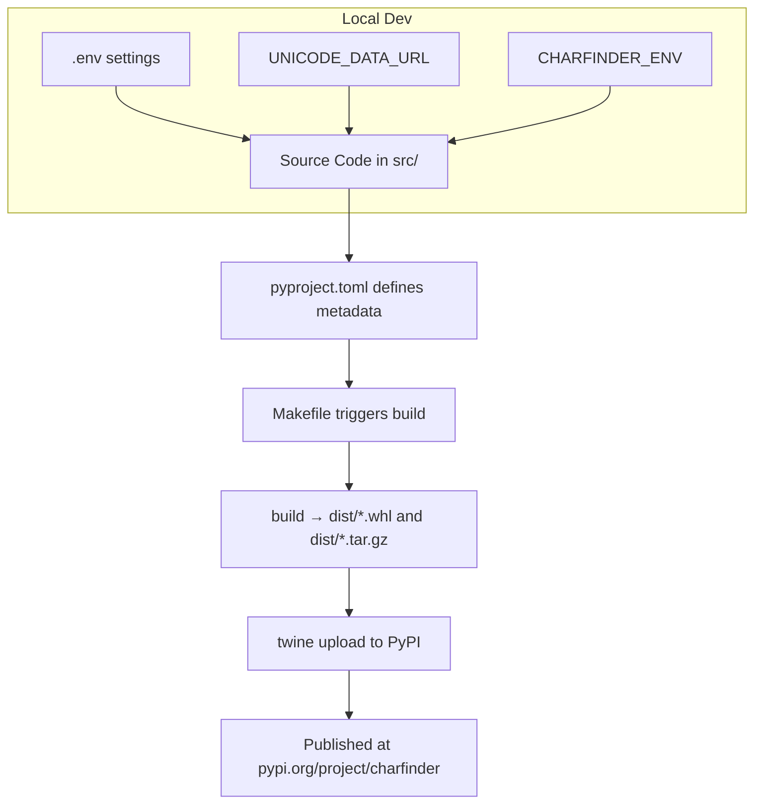

# Packaging and Distribution

This document explains how the **CharFinder** project is structured and packaged for distribution to [PyPI](https://pypi.org/project/charfinder/). It outlines key files, packaging strategies, environment configurations, and usage of modern Python packaging tools.

---

## 🧱 Project Structure

CharFinder follows a modern, source-based project layout:

```
charfinder/
├── src/
│   └── charfinder/        # Core package code
│       ├── __init__.py    # Marks the package and enables versioning
│       └── ...            # Other modules (core, cli, utils, etc.)
├── tests/                 # Unit and integration tests
│   └── ...
├── docs/                  # Markdown documentation (internal use)
├── Makefile               # Developer automation commands
├── pyproject.toml         # Main project metadata and build config
├── MANIFEST.in            # Files to include in the distribution
├── sample.env             # Template for environment variables
├── LICENSE.txt
└── README.md              # PyPI and GitHub landing page
```

---

## 📦 Publishing to PyPI

CharFinder is published on PyPI: [https://pypi.org/project/charfinder/](https://pypi.org/project/charfinder/)

### Build and Publish Workflow

CharFinder uses `setuptools` with a `pyproject.toml`-based configuration. All packaging is handled via the following commands:

```bash
make build               # Builds the wheel and source distribution
make publish             # Uploads to PyPI (must be logged in with twine)
make publish-test        # Uploads to TestPyPI
make publish-dryrun      # Validates the package before uploading
```

These commands internally use:

* `python -m build` for packaging
* `twine` for secure uploading to PyPI or TestPyPI

---

## 📄 Key Packaging Files

### `pyproject.toml`

Defines the project metadata, build backend, and dependencies.
CharFinder uses `setuptools` as the backend:

```toml
[build-system]
requires = ["setuptools>=61", "wheel"]
build-backend = "setuptools.build_meta"
```

Project metadata (excerpt):

```toml
[project]
name = "charfinder"
dynamic = ["version"]
requires-python = ">=3.10"
classifiers = ["Programming Language :: Python :: 3"]
...
```

### `MANIFEST.in`

Ensures all required files are included in the source distribution:

```ini
include README.md
include LICENSE.txt
include pyproject.toml
include src/charfinder/py.typed
recursive-include tests/manual *.ipynb
```

### `src/charfinder/py.typed`

Marks the package as PEP 561-compatible for type checking.

---

## ⚙️ Environment Management

### Environment Configuration

CharFinder relies on `.env` files to manage runtime and packaging-related settings.

Example (`sample.env`):

```ini
CHARFINDER_ENV=DEV
CHARFINDER_LOG_MAX_BYTES=1000000
CHARFINDER_LOG_BACKUP_COUNT=5
CHARFINDER_MATCH_THRESHOLD=0.7
CHARFINDER_COLOR_MODE=auto
CHARFINDER_CACHE_FILE_PATH=data/cache/unicode_name_cache.json
CHARFINDER_DEBUG_ENV_LOAD=0

# Unicode Data source
UNICODE_DATA_URL=https://www.unicode.org/Public/UCD/latest/ucd/UnicodeData.txt
UNICODE_DATA_FILE_PATH=data/UnicodeData.txt
```

These variables influence:

* Logging behavior
* Caching paths
* Match settings
* Color output
* Debug mode
* Unicode data source behavior

### Unicode Data Download Logic

When `charfinder` is executed, it tries to locate the Unicode character name database using this logic:

1. **Check URL**: If `UNICODE_DATA_URL` is provided, it downloads the file and caches it at `UNICODE_DATA_FILE_PATH`.
2. **Fallback to file**: If the URL is unavailable, it checks if the file at `UNICODE_DATA_FILE_PATH` exists and uses that.

This dual strategy ensures resilient Unicode data availability across environments.

---

## 🛠 Makefile Automation

The project includes a `Makefile` with over 60 commands grouped by purpose:

### 🔧 Development

* `make install`, `make develop` — install dependencies
* `make fmt`, `make lint-ruff`, `make type-check` — formatting, linting, static type checking
* `make test`, `make test-file`, `make test-coverage` — test utilities with coverage
* `make check-all` — one-click verify all

### 🧪 Environment and Debugging

* `make env-show`, `make dotenv-debug`, `make env-clear`
* `make clean-*` — remove logs, cache, coverage, build artifacts

### 🔐 Security

* `make safety` — run `safety` for dependency vulnerability scan

---

## 🔁 Packaging Architecture

Here's a conceptual diagram of CharFinder’s packaging and deployment flow:



---

## ✅ Summary

* ✅ Uses modern `src/` layout and `pyproject.toml`-based packaging
* ✅ Supports dynamic configuration via `.env` and Makefile commands
* ✅ Resilient Unicode data logic via `UNICODE_DATA_URL` and `UNICODE_DATA_FILE_PATH`
* ✅ Fully type-checked, linted, and tested with coverage
* ✅ Published and installable via [PyPI](https://pypi.org/project/charfinder/)

---

Next: See [CLI Architecture](./cli_architecture.md) or [Core Logic](./core_logic.md) for deeper implementation insights.
